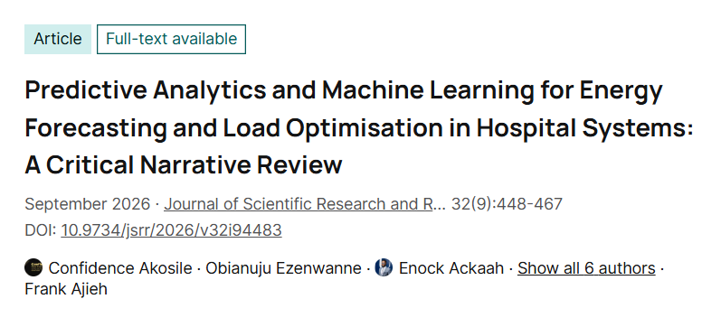
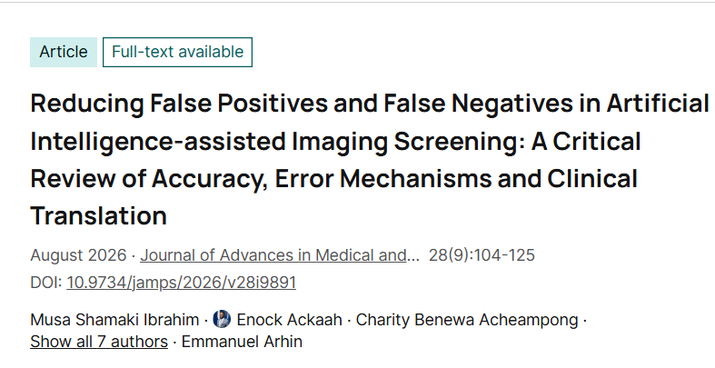

::: {.profile-layout}
::: {.profile-card}

# Enock Kumi Ackaah

**Applied Statistician & Biomedical Data Science Researcher**

Georgia State University 
Atlanta, Georgia

[GitHub](https://github.com/Enock-ackaah) · [LinkedIn](https://www.linkedin.com/in/ackaah-enock-kumi) · [CV](assets/Enock_Kumi_Ackaah_CV.pdf)
:::

::: {.profile-content}
## Enock Kumi Ackaah

I am an applied statistician and biomedical data science researcher at Georgia State University. My work develops reliable, interpretable, and reproducible machine-learning methods for complex biomedical data.

My research focuses on high-dimensional and small-sample prediction, external validation, model calibration, feature-selection stability, and clinically meaningful evaluation.

## Education

::: {.education-entry}
**Georgia State University** 
Atlanta, Georgia · 2026–Present 
M.S. in Applied Statistics
:::

::: {.education-entry}
**The University of Akron** 
Akron, Ohio · 2024–2026 
M.S. in Statistics
:::

::: {.education-entry}
**University of Cape Coast** 
Cape Coast, Ghana · 2019–2023 
B.Sc. in Mathematics and Statistics
:::

## Research interests

- **Reliable biomedical AI:** model stability, calibration, uncertainty, and external validation.
- **High-dimensional biomedical data:** RNA sequencing, DNA methylation, and small-sample prediction.
- **Explainable machine learning:** reproducible feature selection and clinically meaningful interpretation.
:::
:::

## News

- **September 2026:** Published a critical narrative review of machine learning for hospital energy forecasting and load optimisation.
- **August 2026:** Published a critical review of false positives and false negatives in AI-assisted imaging screening.
- **August 2026:** Released a preprint on cancer classification in low- and high-dimensional biomedical data.

## Selected publications

::: {.publication-row}
::: {.publication-thumb}

:::
::: {.publication-details}
### Predictive Analytics and Machine Learning for Energy Forecasting and Load Optimisation in Hospital Systems

Confidence Akosile, Obianuju Ezenwanne, **Enock Ackaah**, et al. 
*Journal of Scientific Research and Reports*, 32(9), 448–467, 2026.

[Article](https://doi.org/10.9734/jsrr/2026/v32i94483){.paper-link} [All publications](publications.qmd){.paper-link}
:::
:::

::: {.publication-row}
::: {.publication-thumb}

:::
::: {.publication-details}
### Reducing False Positives and False Negatives in Artificial Intelligence-assisted Imaging Screening

Musa Shamaki Ibrahim, **Enock Ackaah**, Charity Benewa Acheampong, et al. 
*Journal of Advances in Medical and Pharmaceutical Sciences*, 28(9), 104–125, 2026.

[Article](https://doi.org/10.9734/jamps/2026/v28i9891){.paper-link} [All publications](publications.qmd){.paper-link}
:::
:::
