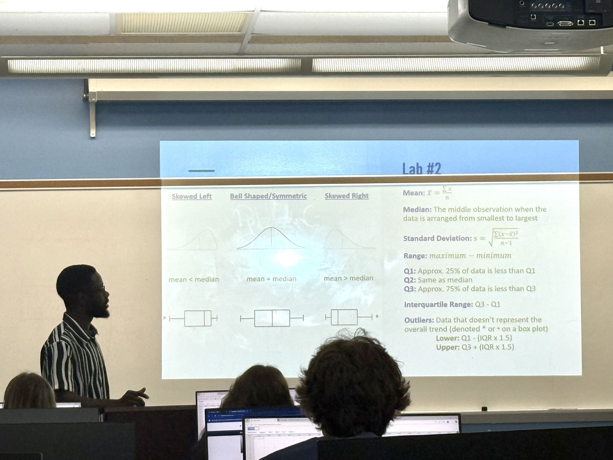
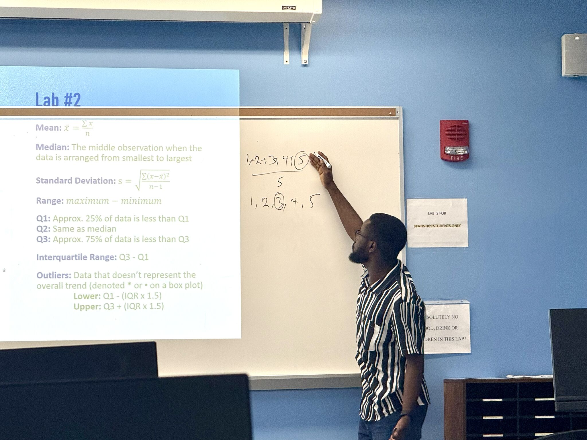
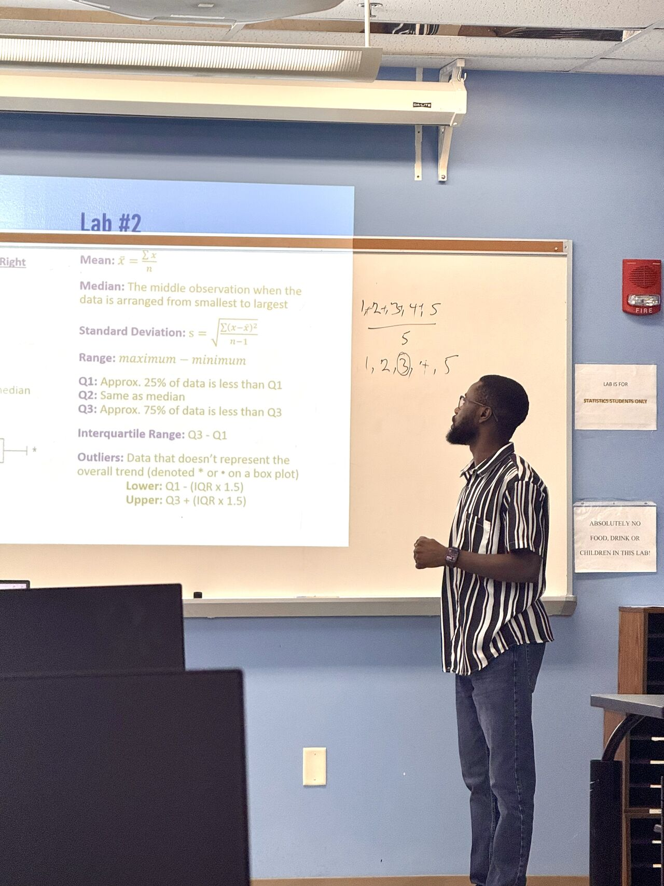
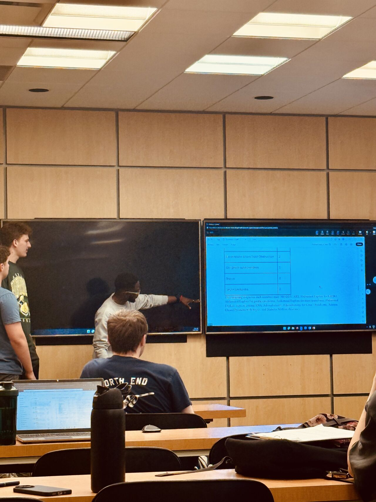

## Teaching approach

My goal is to make statistical reasoning understandable and practical. I connect statistical concepts with software-based analysis, guide students through difficult problems, and encourage them to develop the confidence to solve problems independently.

## Teaching appointments

### Graduate Teaching Assistant and MILE Lab Team Lead

**Department of Mathematics and Statistics, Georgia State University** 
August 2026–Present · Atlanta, Georgia

- Support undergraduate instruction in Elementary Statistics through Microsoft Excel-based laboratory activities.
- Lead Friday tutoring sessions in the Commons MILE Lab, helping students understand homework assignments and apply appropriate statistical methods.
- Explain statistical concepts and Excel procedures clearly, adapting instruction to students with different levels of preparation.
- Serve as a team lead during tutoring sessions, helping organize student support and maintain an effective learning environment.

### Graduate Teaching Assistant

**Department of Statistics, The University of Akron** 
August 2024–May 2026 · Akron, Ohio

- Led weekly statistics laboratory sessions for approximately 15–20 students, connecting statistical concepts with software-based analysis.
- Provided individual and group tutoring in statistics, probability, R, SPSS, and Minitab.
- Graded assignments and assessments for large course sections and provided constructive feedback to support student learning.

### Teaching in Action

::: {.teaching-gallery}

:::
## Statistical consulting

### Graduate Statistical Consulting

**The University of Akron** · Spring 2026 
Faculty supervisor: Dr. Jun Ye

Translated an applied research question into an analytical plan, interpreted the results, and communicated the findings through a collaborative presentation.

### Statistics Consulting Presentation

As part of my statistics consulting coursework, I participated in a classroom presentation focused on communicating statistical methods, analytical findings, and practical recommendations clearly to an audience.

{fig-align="center" width="85%"}
